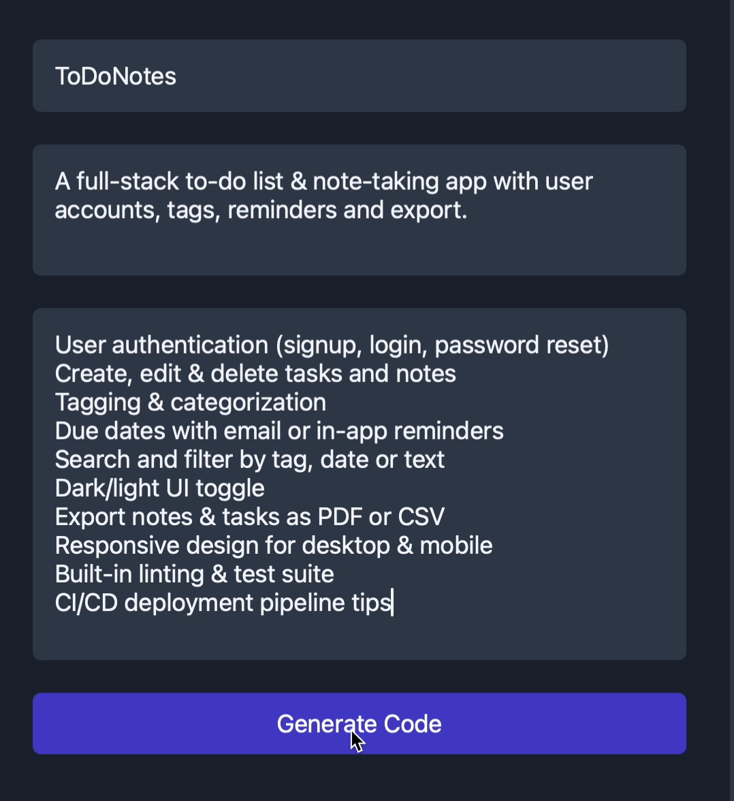
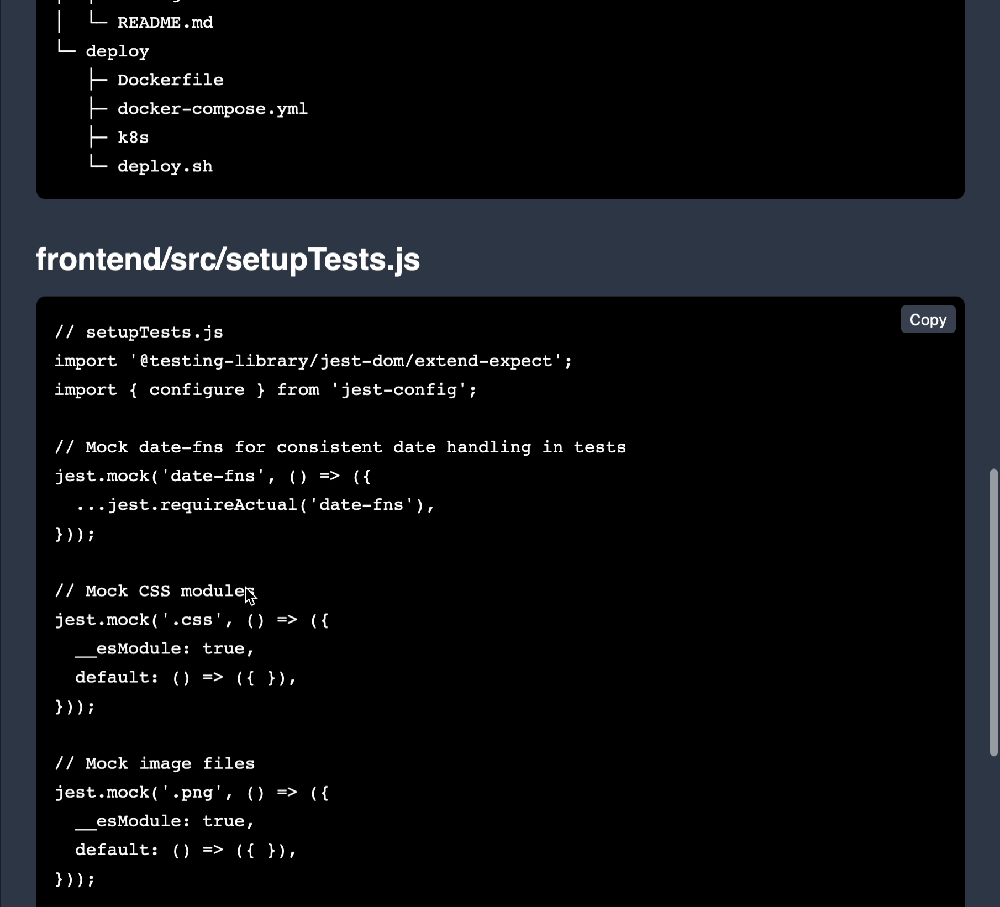
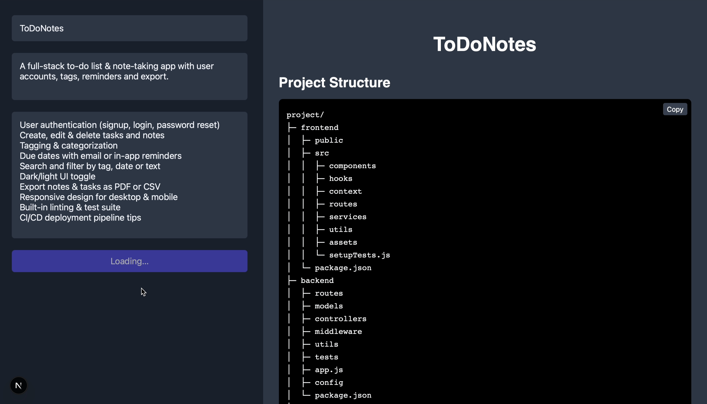

# 🎸 VibeCoder — AI-Powered Full-Stack Code Generator

Turn plain-English prompts into a full-stack application in seconds, powered by DeepSeek R1 Distilled Llama 70B model.

---

## 🎥 Demo

[](media/demo.mp4)

---

## 📸 UI Screenshots

**1. User Inputs Panel**


**2. Generated Code Panel**


**3. Main Screen**


---

## 🧰 Tech Stack

* **Frontend**: Next.js, Tailwind CSS, TypeScript
* **Backend**: FastAPI (Python 3.9+)
* **AI Model**: DeepSeek-70B via Together AI API
* **Styling**: San Francisco system font, modern minimalist design

---

## 🚀 Features

* ⚡ **Instant** full-stack code generation from a short prompt
* 🗂️ Modular output: separate files for frontend, backend, routes, and config
* 🎨 Clean UI: intuitive input fields and live code panels
* 🎛️ Flexible tech stack configuration: choose frameworks, libraries, and settings
* 🔍 Syntax highlighting: improved readability of generated code
* 📈 Ready for extension: add more frameworks or model backends

---

## 🛠️ Setup & Install

1. **Clone the repo**

   ```bash
   git clone https://github.com/KovarthanSuresh/VibeCoder-AI-App-Generator.git
   cd VibeCoder-AI-App-Generator
   ```

2. **Prepare the demo media** (you’ve already added `media/demo.mp4` and `media/screenshots/`)

3. **Backend**

   ```bash
   cd backend
   python3 -m venv .venv
   source .venv/bin/activate
   pip install -r requirements.txt
   cp ../.env.example .env   # fill in your TOGETHER_API_KEY
   uvicorn app:app --reload
   ```

4. **Frontend**

   ```bash
   cd ../frontend
   npm install        # or yarn
   npm run dev        # or yarn dev
   ```

5. **Visit**

   * Frontend at [http://localhost:3000](http://localhost:3000)
   * Backend API at [http://localhost:8000](http://localhost:8000)

---

## 📂 Folder Structure

```
vibecoder/
├── backend/                # FastAPI server & DeepSeek client
├── frontend/               # Next.js UI
├── media/                  # demo.mp4 & screenshots/
│   ├── demo.mp4
│   └── screenshots/
│       ├── user_inputs.png
│       ├── generated_code.png
│       └── main_screen.png
├── .gitignore
├── LICENSE
├── Makefile                # convenience commands
└── README.md
```

---

## 🛣️ Roadmap

* [ ] Export full scaffold as downloadable ZIP
* [ ] Add support for other frameworks (Express, Django, Flutter)
* [ ] In-browser code editor (Monaco)
* [ ] User authentication & saved projects

---

## 🤝 Contributing

1. Fork the repo
2. Create a feature branch (`git checkout -b feat/...`)
3. Commit your changes (`git commit -m 'feat: ...'`)
4. Push to your fork (`git push origin feat/...`)
5. Open a Pull Request

Please ensure code is well-formatted and documented.

---

## 📄 License

This project is MIT-licensed — see the [LICENSE](LICENSE) file for details.

---

## 🧑‍💻 Author

**Kovarthan S.**
[https://github.com/KovarthanSuresh](https://github.com/KovarthanSuresh)
